# 🧠 Argumentation Clustering & Narrative Analysis


> **Advanced computational analysis of argumentative discourse across Reddit and Congressional platforms, featuring stance-aware clustering, narrative flow detection, and representation intensity metrics.**

---

## 📋 Table of Contents

- [🎯 Overview](#-overview)
- [✨ Key Features](#-key-features)
- [🔬 Scientific Motivation](#-scientific-motivation)
- [🏗️ Architecture](#️-architecture)
- [📊 Pipeline Flow](#-pipeline-flow)
- [🧮 Algorithms & Methods](#-algorithms--methods)
- [📁 Output Documentation](#-output-documentation)
- [🚀 Quick Start](#-quick-start)
- [📈 Usage Examples](#-usage-examples)
- [🛠️ Configuration](#️-configuration)
- [📚 Research Applications](#-research-applications)

---

## 🎯 Overview

This repository implements a sophisticated computational framework for analyzing argumentative discourse patterns across digital platforms. The system processes millions of arguments from Reddit discussions and U.S. Congressional hearings to identify:

- **Narrative Flow Patterns**: How arguments progress through causal chains
- **Cross-Platform Representation**: Which Reddit communities mirror Congressional discourse
- **Stance-Aware Clustering**: Grouping arguments while preserving ideological coherence
- **Topic Consolidation**: Merging fragmented topics into coherent themes

## ✨ Key Features

### 🔄 **Automatic Topic Consolidation**
- **Hybrid Similarity Matching**: Combines name, content, structural, and stance compatibility
- **Narrative Flow Detection**: Identifies causal relationships between topics
- **Stance-Aware Merging**: Prevents opposing arguments from being inappropriately grouped
- **Graph-Based Clustering**: Uses network analysis to find natural topic groupings

### 🎯 **Guaranteed Pure Clustering** 
- **Single Topic-Stance per Cluster**: Ensures each cluster represents one coherent narrative
- **BERTopic Integration**: Leverages state-of-the-art topic modeling with KeyBERT-inspired representations
- **Supervised UMAP**: Uses stance labels for better embedding separation
- **Outlier Detection**: Handles edge cases and noise appropriately

### 📊 **Representation Intensity Analysis**
- **RI(L) - Legislator Representation**: Percentage of legislator arguments matching Reddit discourse
- **RI(S) - Subreddit Representation**: Percentage of subreddit arguments reflected in Congress
- **Cross-Platform Similarity**: Cosine similarity-based matching with configurable thresholds
- **Entity-Level Analysis**: Individual member and witness representation tracking

### 🌊 **Directional Narrative Chains**
- **Progression Stage Detection**: Maps arguments to conceptual development stages
- **Causal Flow Visualization**: Shows how narratives evolve (e.g., `health → women's_rights → reproductive_rights → abortion_access`)
- **Dynamic Chain Assignment**: Adapts to different policy domains automatically

---

## 🔬 Scientific Motivation

### The Challenge of Fragmented Discourse Analysis

Traditional topic modeling approaches face critical limitations when analyzing argumentative discourse:

1. **Topic Fragmentation**: Similar concepts get artificially separated (e.g., "abortion rights" vs "reproductive choice")
2. **Stance Conflation**: Pro and con arguments within the same topic get mixed, losing ideological coherence
3. **Cross-Platform Gaps**: No systematic way to measure how online discourse reflects institutional debate
4. **Narrative Blind Spots**: Missing the causal/temporal relationships between related arguments

### Our Solution: Multi-Signal Consolidation + Pure Clustering

<details>
<summary><strong>🔍 Click to expand: Detailed Motivation</strong></summary>

#### **Problem 1: Topic Fragmentation**
**Traditional Approach**: BERTopic might create separate clusters for:
- "reproductive health care"
- "women's reproductive rights" 
- "abortion access"
- "family planning services"

**Our Solution**: AutomaticConsolidator uses hybrid similarity to merge these into:
- Representative topic: "reproductive rights"
- Preserves all original nuances in the `wiba_topics` column

#### **Problem 2: Stance Conflation** 
**Traditional Approach**: One cluster containing:
- "Abortion is a fundamental right" (Pro)
- "Abortion violates sanctity of life" (Con)

**Our Solution**: Guaranteed Pure Clustering ensures:
- Cluster A: Only pro-choice arguments about reproductive rights
- Cluster B: Only pro-life arguments about reproductive rights
- Maintains topic coherence while preserving stance purity

#### **Problem 3: Cross-Platform Analysis**
**Challenge**: How do we know if Reddit discourse `r/politics` reflects what members of Congress actually say?

**Our Solution**: Representation Intensity metrics:
- **RI(L)**: % of Rep. Smith's arguments that match `r/politics` discourse
- **RI(S)**: % of `r/politics` arguments that appear in Congressional testimony

#### **Problem 4: Narrative Understanding**
**Traditional View**: Topics as isolated entities

**Our View**: Topics as part of causal progressions:
```
health concerns → women's autonomy → reproductive rights → abortion policy
economic anxiety → job security → trade policy → immigration restrictions
```

</details>

---

## 🏗️ Architecture

<details>
<summary><strong>📐 System Architecture Diagram</strong></summary>


</details>

---

## 📊 Pipeline Flow

### Stage 1: Data Preprocessing & Embedding

<details>
<summary><strong>🔄 Data Processing Pipeline</strong></summary>


**Key Preprocessing Steps:**
- **Reddit Normalization**: Removes platform-specific artifacts (`/u/username`, `/r/subreddit`)
- **Congressional Normalization**: Strips formal parliamentary language and titles
- **Unified Lowercasing**: Ensures consistent comparison across platforms
- **Embedding Model**: Uses domain-specific fine-tuned sentence transformer for political discourse

</details>

### Stage 2: Automatic Topic Consolidation

```mermaid
flowchart TD
    subgraph "Input Topics"
        A["abortion rights\nreproductive choice\nfamily planning\nwomens health"]
    end
    
    subgraph "Similarity Matrices"
        B["Name Similarity\nSemantic embeddings"]
        C["Content Similarity\nDocument centroids"]
        D["Structural Similarity\nWord overlap"]
        E["Stance Compatibility\nPro/Con alignment"]
        F["Narrative Relationships\nCausal flow detection"]
    end
    
    subgraph "Graph-Based Merging"
        G["Weighted Combination\nα₁B + α₂C + α₃D + α₄E + α₅F"]
        H["Connected Components\nNetwork clustering"]
        I["Representative Selection\nMost frequent/general"]
    end
    
    subgraph "Output"
        J["Consolidated Topics\nreproductive rights"]
    end
    
    A --> B
    A --> C
    A --> D
    A --> E
    A --> F
    
    B --> G
    C --> G
    D --> G
    E --> G
    F --> G
    
    G --> H
    H --> I
    I --> J
    
    style G fill:#e1f5fe
    style E fill:#ffebee
```

<details>
<summary><strong>🔗 Topic Consolidation Algorithm</strong></summary>



**Consolidation Formula:**
```
Combined_Similarity = 0.2×Name + 0.3×Content + 0.1×Structural + 0.25×Stance + 0.15×Narrative
```

**Stance Compatibility Rules:**
- ✅ `pro_choice` + `reproductive_rights` = High compatibility
- ❌ `pro_choice` + `pro_life` = Zero compatibility  
- ⚠️ `mixed_stance` + `pure_stance` = Reduced compatibility

</details>

### Stage 3: Guaranteed Pure Clustering

<details>
<summary><strong>🎯 Pure Clustering Strategy</strong></summary>


**Purity Guarantee:**
- ✅ Every cluster contains exactly one topic + one stance combination
- ✅ No mixing of pro/con arguments within clusters
- ✅ Preserves ideological coherence while finding sub-themes

</details>

### Stage 4: Narrative Flow Detection

<details>
<summary><strong>🌊 Directional Narrative Chains</strong></summary>


**Chain Detection Algorithm:**
1. **Keyword Matching**: Topics matched against progression stage keywords
2. **Score Calculation**: `keyword_matches + stage_matches` for best fit
3. **Stage Highlighting**: Current position shown in brackets `[current_stage]`
4. **Directional Arrows**: `→` indicates causal/temporal progression

</details>

---

## 🧮 Algorithms & Methods

### Core Technologies

| Component | Method | Implementation |
|-----------|--------|----------------|
| **Embeddings** | Contrastive Fine-tuned MPNet | `/vienna/models/contrastive_finetune_v2_mpnet-v2_mal` |
| **Topic Modeling** | BERTopic + KeyBERT | `bertopic.BERTopic` with `KeyBERTInspired` representation |
| **Clustering** | Hierarchical + Graph-based | `sklearn.cluster.AgglomerativeClustering` + `networkx` |
| **Dimensionality Reduction** | Supervised UMAP | `cuml.manifold.UMAP` with stance labels |
| **Similarity** | Cosine + Euclidean | `sklearn.metrics.pairwise.cosine_similarity` |

### Key Parameters

<details>
<summary><strong>⚙️ Algorithm Configuration</strong></summary>

```python
# Topic Consolidation
CONSOLIDATION_CONFIG = {
    "similarity_threshold": 0.6,      # Minimum similarity for merging
    "weights": {
        "name_similarity": 0.2,       # Topic name semantic similarity
        "content_similarity": 0.3,    # Document content similarity  
        "structural_similarity": 0.1, # Word overlap measures
        "stance_compatibility": 0.25, # Pro/con alignment
        "narrative_relationships": 0.15 # Causal flow detection
    }
}

# Pure Clustering  
CLUSTERING_CONFIG = {
    "min_topic_size": 10,            # Minimum documents per cluster
    "embedding_model": "mpnet-v2",   # Sentence transformer model
    "representation_model": [        # Chain of representation models
        "KeyBERTInspired()",
        "MaximalMarginalRelevance(diversity=0.3)"
    ]
}

# Representation Analysis
REPRESENTATION_CONFIG = {
    "similarity_threshold": 0.70,    # Cosine similarity cutoff
    "sample_size": 10000,           # Max samples per dataset  
    "entity_types": ["member", "witness"] # Congressional actors
}
```

</details>

---

## 📁 Output Documentation

The primary output is `clusters_to_visualize.csv` containing comprehensive cluster analysis results.

### Column Specifications

<details>
<summary><strong>📊 Complete Column Reference</strong></summary>

| Column | Type | Description | Example |
|--------|------|-------------|---------|
| `cluster` | int | Unique cluster identifier | `42` |
| `topic_label` | str | BERTopic-generated descriptive label (stance-free) | `abortion rights women healthcare` |
| `narrative_chain` | str | Directional progression with current stage highlighted | `health → [womens_rights] → reproductive_rights → abortion_access` |
| `wiba_topics` | str | Consolidated topic labels from AutomaticConsolidator | `reproductive_rights_womens_autonomy_healthcare_choice` |
| `parent_topic` | int | Hierarchical parent cluster (-1 if root) | `15` |
| `has_subtopics` | bool | Whether cluster has child clusters | `true` |
| `source_distribution` | dict | Breakdown of Congressional vs Reddit arguments | `{'Congressional': 23.4, 'Reddit': 76.6, ...}` |
| `cluster_size` | int | Total arguments in cluster | `1,247` |
| `overlap_score` | float | Min(Congressional%, Reddit%) - representation balance | `23.4` |
| `reddit_pct` | float | Percentage of total Reddit args in this cluster | `15.2` |
| `congress_pct` | float | Percentage of total Congressional args in this cluster | `8.7` |
| `overlap_percentage` | float | Same as overlap_score (for compatibility) | `8.7` |
| `reddit_arguments_in_cluster` | int | Raw count of Reddit arguments | `1,892` |
| `congress_arguments_in_cluster` | int | Raw count of Congressional arguments | `355` |
| `total_reddit_arguments` | int | Total Reddit arguments in dataset | `342,156` |
| `total_congress_arguments` | int | Total Congressional arguments in dataset | `89,234` |
| `num_representative_docs` | int | Number of representative documents extracted | `50` |
| `dominant_stance` | str | Most common stance with percentage | `Argument_For (78%)` |
| `representative_documents` | str | Top representative arguments (escaped) | `[Reddit] Women deserve autonomy&#44; [Congressional] Healthcare decisions...` |
| `representative_documents_continued` | str | Continuation if >50 documents | `[Reddit] Personal choice matters&#44; [Congressional] Medical privacy...` |

</details>

### Understanding Key Columns

<details>
<summary><strong>🔍 Deep Dive: Critical Columns Explained</strong></summary>

#### **`narrative_chain`**: Directional Progression Analysis
Shows where the cluster fits in causal argument development:

```
health → [womens_rights] → reproductive_rights → abortion_access
```

- **`health`**: Foundation medical/safety concerns
- **`[womens_rights]`**: **Current cluster position** - arguments about gender equality/autonomy  
- **`reproductive_rights`**: Specific policy framework arguments
- **`abortion_access`**: Implementation and access arguments

**Other Examples:**
- `violence_concern → [public_safety] → gun_regulation → policy_implementation`
- `environmental_concern → scientific_evidence → [policy_development] → implementation`

#### **`wiba_topics`**: Consolidated Topic Labels
Shows the actual merged topic names from AutomaticConsolidator:

- **Before consolidation**: `"abortion rights"`, `"reproductive choice"`, `"womens healthcare"`
- **After consolidation**: `reproductive_rights_womens_autonomy_healthcare_choice`
- **Represents**: The fundamental themes this cluster discusses

#### **`overlap_score`**: Cross-Platform Representation
Measures how balanced the cluster is across platforms:

- **High overlap (>10%)**: Topic discussed similarly in both Reddit and Congress
- **Low overlap (<5%)**: Platform-specific discourse
- **Formula**: `min(reddit_pct, congress_pct)`

**Interpretation:**
- `overlap_score = 15.2%` → Balanced representation across platforms
- `overlap_score = 2.1%` → Primarily single-platform discussion

#### **`source_distribution`**: Detailed Platform Breakdown
Complex object showing exact percentages and counts:

```json
{
  "Congressional": 23.4,        // % of total Congressional args
  "Reddit": 76.6,              // % of total Reddit args  
  "Congressional_count": 355,   // Raw count Congressional
  "Reddit_count": 1892         // Raw count Reddit
}
```

</details>

### Sample Output

<details>
<summary><strong>📄 Example Cluster Entry</strong></summary>

```csv
cluster,topic_label,narrative_chain,wiba_topics,overlap_score,reddit_pct,congress_pct,cluster_size,dominant_stance,representative_documents
42,"abortion rights women healthcare","health → [womens_rights] → reproductive_rights → abortion_access","reproductive_rights_womens_autonomy_healthcare_choice",8.7,15.2,8.7,1247,"Argument_For (78%)","[Reddit] Women deserve the right to make their own healthcare decisions&#44; [Congressional] The fundamental issue here is womens autonomy over their own bodies&#44; [Reddit] This is about basic human rights and dignity..."
```

**Interpretation:**
- **Cluster 42**: Contains 1,247 arguments about women's reproductive rights
- **Narrative Position**: Focused on women's rights stage of abortion discourse progression  
- **Platform Balance**: 15.2% of Reddit args, 8.7% of Congressional args (8.7% overlap)
- **Stance**: Predominantly pro-choice (78%)
- **Topics**: Merged from multiple related reproductive rights topics

</details>

---

## 🚀 Quick Start

### Prerequisites

```bash
# Python 3.8+ required
pip install pandas numpy scikit-learn
pip install sentence-transformers bertopic
pip install cupy cuml  # For GPU acceleration
pip install networkx tqdm plotly
```

### Basic Usage

```python
# Run complete analysis for abortion topic
python calculate_representation.py --topic abortion

# Enable topic consolidation 
python calculate_representation.py --topic abortion --consolidate_topics

# Create Sankey diagram
python calculate_representation.py --topic abortion --create_sankey

# Custom configuration
python calculate_representation.py \
    --topic gmo \
    --sample_size 5000 \
    --similarity_threshold 0.75 \
    --consolidate_topics \
    --consolidation_threshold 0.6
```

### Advanced Configuration

<details>
<summary><strong>⚙️ Configuration Options</strong></summary>

```python
# Topic consolidation settings
python calculate_representation.py \
    --topic nuclear \
    --consolidate_topics \
    --consolidation_method hybrid \
    --consolidation_threshold 0.6

# Sankey visualization settings  
python calculate_representation.py \
    --create_sankey \
    --sankey_min_size 100 \
    --sankey_top_n 15

# Representation analysis settings
python calculate_representation.py \
    --similarity_threshold 0.70 \
    --sample_size 10000
```

**Available Topics:**
- `abortion`: Abortion and reproductive rights
- `gmo`: Genetically modified organisms  
- `nuclear`: Nuclear energy and weapons
- `gun_control`: Gun policy and regulation

</details>

---

## 📈 Usage Examples

### Example 1: Basic Cluster Analysis

```python
import pandas as pd

# Load results
clusters = pd.read_csv("clusters_to_visualize_abortion.csv")

# Find most balanced clusters (high overlap)
balanced = clusters[clusters['overlap_score'] > 10].sort_values('overlap_score', ascending=False)
print("Most balanced clusters across platforms:")
print(balanced[['cluster', 'topic_label', 'overlap_score', 'cluster_size']].head())

# Analyze narrative progression
progression_counts = clusters['narrative_chain'].value_counts()
print("\nNarrative progression distribution:")
print(progression_counts.head())
```

### Example 2: Representation Intensity Analysis

```python
# Load member representation data
members = pd.read_csv("member_subreddit_representation_abortion.csv")

# Find highly representative members
high_rep = members[members['RI_legislator'] > 50].sort_values('RI_legislator', ascending=False)
print("Members with highest Reddit representation:")
print(high_rep[['speaker_last', 'speaker_first', 'RI_legislator', 'total_arguments']].head())

# Analyze subreddit-specific representation
politics_cols = [col for col in members.columns if 'politics_RI' in col]
print(f"\nr/politics representation: {members[politics_cols[0]].mean():.1f}%")
```

### Example 3: Cross-Platform Topic Analysis

```python
# Compare platform-specific clusters
reddit_heavy = clusters[clusters['reddit_pct'] > clusters['congress_pct'] * 2]
congress_heavy = clusters[clusters['congress_pct'] > clusters['reddit_pct'] * 2]

print(f"Reddit-heavy clusters: {len(reddit_heavy)}")
print(f"Congress-heavy clusters: {len(congress_heavy)}")

# Analyze topic differences
print("\nReddit-heavy topics:")
print(reddit_heavy['topic_label'].head())
print("\nCongress-heavy topics:")  
print(congress_heavy['topic_label'].head())
```

---

## 🛠️ Configuration

### Topic Configuration

The system supports multiple policy domains through `TOPIC_CONFIGS`:

<details>
<summary><strong>📝 Topic Configuration Details</strong></summary>

```python
TOPIC_CONFIGS = {
    'abortion': {
        'congress_file': "/path/to/congress_abortion.pkl",
        'reddit_file': "/path/to/reddit_abortion.pkl", 
        'output_prefix': 'abortion'
    },
    'gmo': {
        'congress_file': "/path/to/congress_gmo.pkl",
        'reddit_file': "/path/to/reddit_gmo.pkl",
        'output_prefix': 'gmo'
    },
    # Add new topics here...
}
```

**Adding New Topics:**
1. Prepare Congressional and Reddit datasets with required columns
2. Add configuration entry to `TOPIC_CONFIGS`
3. Ensure member/witness identification files exist
4. Run analysis: `python calculate_representation.py --topic new_topic`

</details>

### Model Configuration

<details>
<summary><strong>🤖 Model Settings</strong></summary>

```python
# Embedding model (modify in calculate_representation.py)
EMBEDDING_MODEL = '/home/arman/vienna/models/contrastive_finetune_v2_mpnet-v2_mal'

# BERTopic configuration
BERTOPIC_CONFIG = {
    'min_topic_size': 10,
    'nr_topics': None,  # Auto-detect
    'calculate_probabilities': False,
    'representation_model': [
        KeyBERTInspired(),
        MaximalMarginalRelevance(diversity=0.3)
    ]
}

# Consolidation weights (modify in AutomaticConsolidator.py)
CONSOLIDATION_WEIGHTS = {
    'name_similarity': 0.2,
    'content_similarity': 0.3, 
    'structural_similarity': 0.1,
    'stance_compatibility': 0.25,
    'narrative_relationships': 0.15
}
```

</details>

---

## 📚 Research Applications

### Political Science Applications

<details>
<summary><strong>🏛️ Research Use Cases</strong></summary>

1. **Elite-Mass Opinion Linkage**
   - Measure how Congressional rhetoric reflects grassroots sentiment
   - Identify gaps between institutional and public discourse
   - Track opinion leadership and influence patterns

2. **Narrative Framing Analysis**  
   - Map how policy arguments evolve through causal chains
   - Identify dominant framing strategies by party/ideology
   - Measure narrative convergence across platforms

3. **Representation Quality Assessment**
   - Quantify descriptive vs substantive representation
   - Identify under-represented perspectives in Congressional debate
   - Measure responsiveness to constituent concerns

4. **Cross-Platform Information Flow**
   - Track argument diffusion from social media to institutional settings
   - Identify influential communities and opinion leaders
   - Measure platform-specific discourse patterns

</details>

### Computational Social Science Applications

<details>
<summary><strong>🔬 Technical Applications</strong></summary>

1. **Stance-Aware Topic Modeling**
   - Benchmark for preserving ideological coherence in clustering
   - Framework for multi-signal topic consolidation
   - Template for cross-platform discourse analysis

2. **Narrative Flow Detection**
   - Novel approach to causal argument progression
   - Framework for temporal discourse analysis
   - Template for argument development tracking

3. **Representation Intensity Metrics**
   - Quantitative measures of cross-platform representation
   - Framework for entity-level discourse analysis
   - Template for influence and responsiveness measurement

4. **Hybrid Clustering Approaches**
   - Integration of multiple similarity signals
   - Graph-based consolidation methods
   - Stance-compatibility preservation techniques

</details>

---

## 📄 License

MIT License - see [LICENSE](LICENSE) file for details.

---

## 🤝 Contributing

1. Fork the repository
2. Create a feature branch (`git checkout -b feature/amazing-feature`)
3. Commit your changes (`git commit -m 'Add amazing feature'`)
4. Push to the branch (`git push origin feature/amazing-feature`)
5. Open a Pull Request

---

## 📞 Contact

For questions about the methodology, implementation, or research applications, please open an issue or contact the maintainers.

---